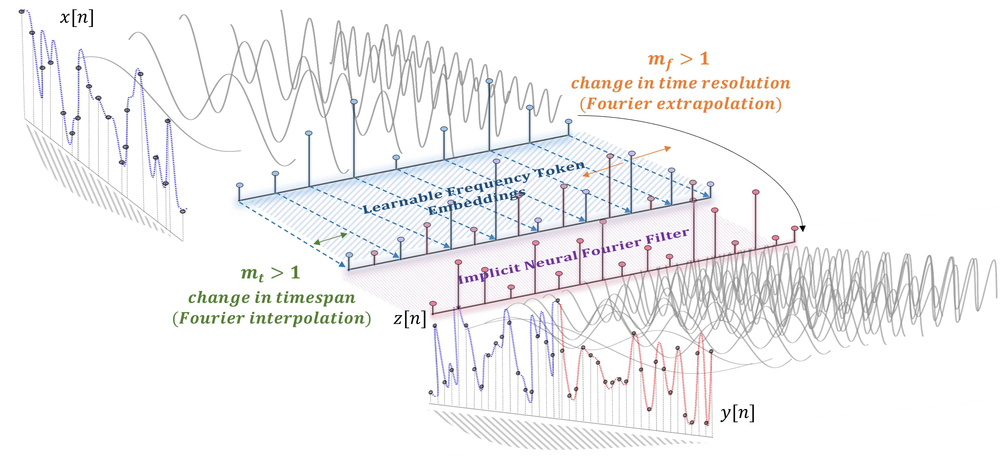
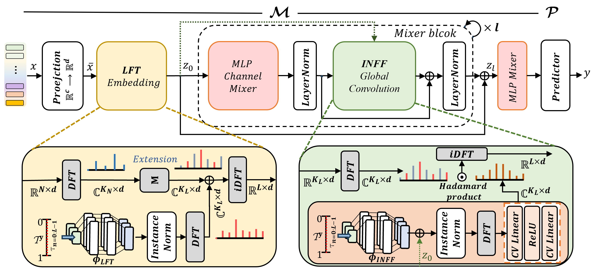

>📋  A template README.md for code accompanying a Machine Learning paper

# Neural Fourier Space Modelling for Time Series

This repository is the official implementation of Neural Fourier Space Modelling for Time Series.
<!-- [Neural Fourier Space Modelling for Time Series](https://arxiv.org/abs/2030.12345).  -->


Neural Fourier Space Modelling (NFM) which models time series directly in the Fourier domain is a compact and general solution to a range of time series problems. 





Two fundamental aspects of DFT are extensively explored.
1) DFT provides samples of "functional" representations of the time-domain discrete signals as a function of frequency, and explicitly leveraging this allows learning a function-to-function mapping (i.e., continuous-time) in a compact form.

2) Manipulating data (zero-padding/zero-interleaving) in the Fourier domain is equivalent to resampling and extending timespan of original discrete signals. We reinterpret it into Fourier extrapolation/interpolation and reformulate into a principal learning mechanism of NFM that provides flexible way of specializing NFM to various time series analysis without a need of single architectural modification.  


We also introduce two learning modules.  
- Learnable frequency tokens (LFTs) learn effective spectral priors and enable an efficient & flexible frequency extension with single parameterization.
- Implicit Neural Fourier Filter (INFF) is a continous global convolution which is both instance-adaptive and mode-aware, improving the performance by notable margin. 

## Getting started
Clone the NFM repository via git as follows:

```clone
git clone https://github.com/minkiml/NFM.git
```

Then, install requirements as follows:

```setup
pip install -r requirements.txt
```
The current implementation uses a single GPU and provides no multiple GPU setup. 
<!-- There is a sub-folder for each task, under which you can find all task-specific codes, e.g., dataloaders, trainer, run scripts, etc.   -->

## Datasets
Download datasets from below links. 

1. You can download all forecastubg datasets from [Autoformer](https://drive.google.com/drive/folders/1ZOYpTUa82_jCcxIdTmyr0LXQfvaM9vIy).

2. For classification, running the experimental scripts (MFCC and raw) automaticall downloads the SpeechCommnad dataset and does necessary pre-processing & formatting.

3. For anomaly detection, all the used datasets can be downloaded from [Anomaly Transformer](https://drive.google.com/drive/folders/1gisthCoE-RrKJ0j3KPV7xiibhHWT9qRm).

Create a seperate folder and save the downloaded datasets in the directory. Then, specify the location of datasets in the run scripts under each sub-folder.
We examplify ones in ETTm and speechcommand run scripts.

## Training & evaluation
We have separated run scrips and main ... for each task.  

Once you have downloaded the necessary datasets, you are all set to run the experiments.

### Forecasting
To train NFM on the forecasting task, do
```trainf
sh ./Forecasting/scripts/ETTm.sh
```
- This will run NFM training on ETTm1 and ETTm2 in the conventional setup (equal input and output resolution).
- The evaluation automatically follows after it.
- The .sh run script also contains "testing on different resolution outputs" which is also made right after the conventional forecasting over all 4 horizons. 
- Replace ETTm to others for training NFM on others.

### Classification
To train NFM for classification task on raw SpeechCommand, do 

```trainc
sh ./Classification/scripts/speechcommand_raw.sh 
```
This also runs both training and evaluations, including normal scenario and different sampling rate scenario.  


To train NFM on MFCC, do 
```trainc
sh ./Classification/scripts/speechcommand.sh 
```
This also runs evaluations afterwards.

### Anomaly Detection
To train NFM on anomaly detection task, do
```traina
sh ./AnomalyD/scripts/SMD.sh 
```
Replace SMD to others for training on others. 

Note that as mentioned in the main work, we found some flaws in the other's official implementation codes. 
We provide fixed code samples (in ... ) that we used to replace their original ones and to run the implementation codes. 

## Main Results

NFM achieves the following state-of-the-art performances with only **27k** (forecasting), **37k** (classification), and **7.8k** (anomaly detection) parameters and without a single architectural modification:

### Forecasting

Conventional setup (input and ouput resolution are the same)
>📋  Include a table of results from your paper, and link back to the leaderboard for clarity and context. If your main result is a figure, include that figure and link to the command or notebook to reproduce it. 

...

#### Some findings from the forecasting experiment that may inspire one's future work
- A number of forecasting baselines are largely over-parameterized (). One interesting practice that is more and more often done in the community of time series forecasting is adopting a very "wide" prediction head (a potential structural demerit of chunk-to-chunk mapping). For example, more than 95% of PatchTST's parameters (~40K in backbone encoder vs ~8.3M in prediction head) belongs to the wide prediction head.
Regarding this, we argue that it would be hard to ... since the wide prediction head may contribute too much ... . In NFM, the prediction head is nothing but feature-to-feature (timestep-to-timestep) mapping, thus the contribution of the prediction head is completely decoupled for learning temporal dependecy.  

- We found a strong indication that the current forecasting models tend to focus more on global features (low frequency information) and less leverage on local features (high frequency information) as prediction horizon gets longer - See Appendix E.3 in our work. Working towards integrating a mechanism that lets models to utilize more of the local features could a good direction of study. 

### Classification 

### Aomaly detection


## How to use NFM for your own dataset and task
We provide a short [demo](demo/simple_demo.ipynb) on how to apply NFM to one's own data and task.

## Citation
If you cite our work, 
>📋  Pick a licence and describe how to contribute to your code repository. 
<!-- 
## Contact
If you have any queries, please email us (mkim332@aucklanduni.ac.nz). -->