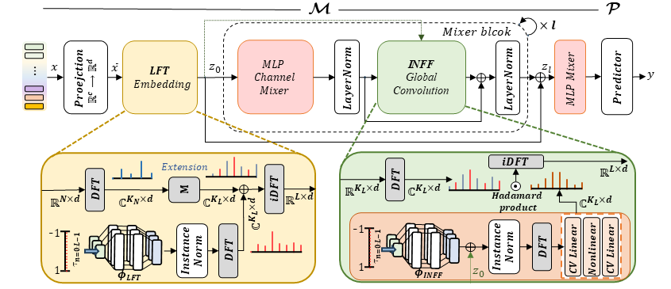
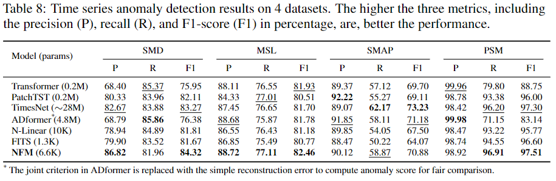

# Neural Fourier Modelling: A Highly Compact Approach to Time-Series Analysis

This repository is the official implementation of "Neural Fourier Modelling: A Highly Compact Approach to Time-Series Analysis
".
<!-- [Paper link](link).  -->

*Neural Fourier Modelling (**NFM**) which models time series directly in the Fourier domain is **a highly compact yet powerful general solution** to a range of time series problems.*




Two fundamental aspects of DFT are extensively explored.
1) DFT provides samples of "functional" representations of the time-domain discrete signals as a function of frequency, and explicitly leveraging this allows learning a function-to-function mapping in a compact form.

2) Manipulating data (zero-padding/zero-interleaving) in the Fourier domain is equivalent to resampling and extending timespan of original discrete signals. We reinterpret it into Fourier extrapolation/interpolation and reformulate into a principal learning mechanism of NFM that provides flexible way of specializing NFM to various time series analysis without a need of single architectural modification.  


We also introduce two learning modules.  
- Learnable frequency tokens (LFTs) learn effective spectral priors and enable an efficient & flexible frequency extension with single parameterization.
- Implicit Neural Fourier Filter (INFF) is a continous global convolution which is both instance-adaptive and mode-aware, improving the performance by notable margin. 

## Getting started
Clone the NFM repository via git as follows:

```clone
git clone https://github.com/minkiml/NFM.git
```

Then, install requirements as follows:

```setup
pip install -r requirements.txt
```
The current implementation uses a single GPU and provides no multiple GPU setup. 
<!-- There is a sub-folder for each task, under which you can find all task-specific codes, e.g., dataloaders, trainer, run scripts, etc.   -->

## Datasets
Download datasets from below links. 

1. You can download all forecasting datasets from [Autoformer](https://drive.google.com/drive/folders/1ZOYpTUa82_jCcxIdTmyr0LXQfvaM9vIy).

2. For classification, running the experimental scripts (MFCC and raw) automaticall downloads the SpeechCommnad dataset and does necessary pre-processing & formatting.

3. For anomaly detection, all the used datasets can be downloaded from [Anomaly Transformer](https://drive.google.com/drive/folders/1gisthCoE-RrKJ0j3KPV7xiibhHWT9qRm).

Create a seperate folder and save the downloaded datasets in the directory. Then, specify the location of datasets in the run scripts under each sub-folder.
We examplify ones in ETTm and speechcommand run scripts.

## Training & evaluation
Once you have downloaded the necessary datasets, you are all set to run the experiments.

There are run scrips and main&solver separated for each task. The main entrypoint is named *_main.py for each task (e.g., [FC_main.py](FC_main.py) is the main entrypoint for forecasting task).    

### Forecasting
To train NFM on the forecasting task, do
```trainf
sh ./Forecasting/scripts/ETTm1.sh
```
- This will run NFM training on ETTm1 in the conventional setup (equal input and output resolution).
- The evaluation automatically follows after it.
- The .sh run script also contains "testing on different resolution outputs" which is also made automatically right after the conventional forecasting over all 4 horizons. 

### Classification
To train NFM for classification task on raw SpeechCommand, do 

```trainc
sh ./Classification/scripts/speechcommand_raw.sh 
```
This also runs both training and evaluations, including normal scenario and different sampling rate scenario.  


To train NFM on MFCC, do 
```trainc
sh ./Classification/scripts/speechcommand.sh 
```

### Anomaly Detection
To train NFM on anomaly detection task, do
```traina
sh ./AnomalyD/scripts/SMD.sh 
```

Note that we found some bugs in the other's official implementation codes. 

We provide fixed code samples and details that we used to replace their original ones and to run the implementation codes in [folder](etc).

## Main Results

- NFM achieves the state-of-the-art performances across various time series tasks.
- NFM is remarkably compact, only consuming up to **27K** (forecasting), **37K** (classification), and **6.6K** (anomaly detection) parameters to be trained.
- NFM is verstile as requiring no architectural modification to be specialized to the different tasks.
- NFM learns function-to-function mapping (i.e., continuous time), and can generalize to time series with previously unseen sampling rate well without re-training.  

### Forecasting

Conventional setup (input and ouput resolution are the same)


At different testing-time sampling rate


- This result shows a strong indication that the current forecasting models tend to focus more on global features (low frequency information) and leverage less on local features (higher frequency information) as prediction horizon gets longer - See Appendix E.3 for analysis in our work. 

### Classification 
NFM works well on both pre-processed features (MFCC) and long raw waveform of 16k in length, yielding overall 2nd top-tier performance (in conventional setup) and the least performance degradation (at different testing-time sampling rate).


### Anomaly detection
NFM, which is formulated into a context learning setup, shows effectiveness in anomaly detection task.



## How to use NFM on your own dataset and task
We provide a short and quick [demo](demo/simple_demo.ipynb) on how to set up NFM and apply it to one's own data and task.


<!-- ## Citation
If you cite our work, 
>📋  Pick a licence and describe how to contribute to your code repository.  -->
<!-- 

